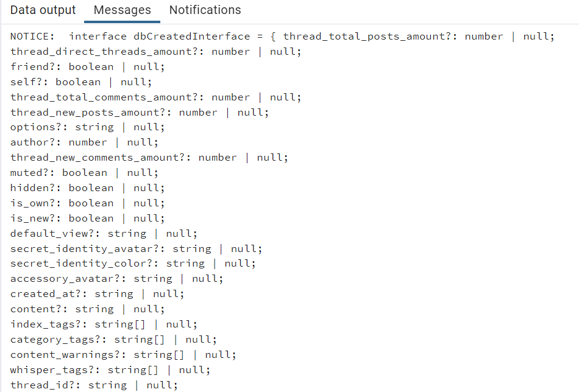

# typemaker

Currently, `typemaker` exists for PostgreSQL only: [click here](./PostgreSQL/). See below for more details.

### How to use
For **Postgres** installations: run [this script](./PostgreSQL/typemaker.pgsql) in your pgAdmin console, replacing placeholders with your queries of interest. 

> Typemaker for PostgreSQL (see the query [here](./PostgreSQL/typemaker%20test.pgsql))

For other dialects: TBD--see below.

### Why to use
Do you have a SQL database? Do you have TypeScript talking to your SQL database? Are your TypeScript interfaces very sad about this?

`typemaker` is specifically a rough-draft timesaving tool: it does the rote part of typing out an interface so you have somewhere to start from.

### Limitations
- The amount of metadata a query "knows" about itself is limited: for example, either everything will be marked as nullable or nothing is.
- SQL data types vary by dialect and loosely correspond to TypeScript's; some nuances will be lost. See individual scripts for details for now.
- Dialect differences mean we are currently restricted to individual scripts for each one. The first typemaker was written for [PostgreSQL](./PostgreSQL/); others are forthcoming.

## Contributions
Contributions are welcome. Some suggestions:
- Open an issue for things I didn't see coming
- Add variants in other dialects
- Add prewritten variants with different ways of handling nullable values

### Future developments
- Add other dialects (T-SQL is my personal first priority)
- Option to guess whether columns are nullable based on the example output
- Example cases with a toy query/table/database for demonstration purposes
- Add per-variant README in each folder